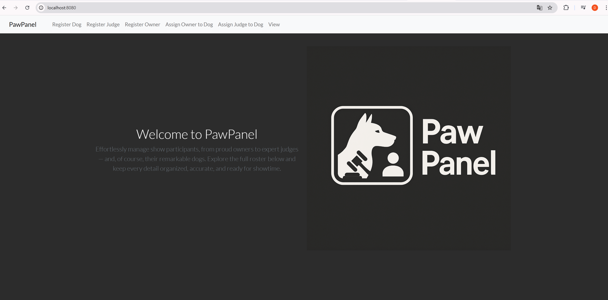
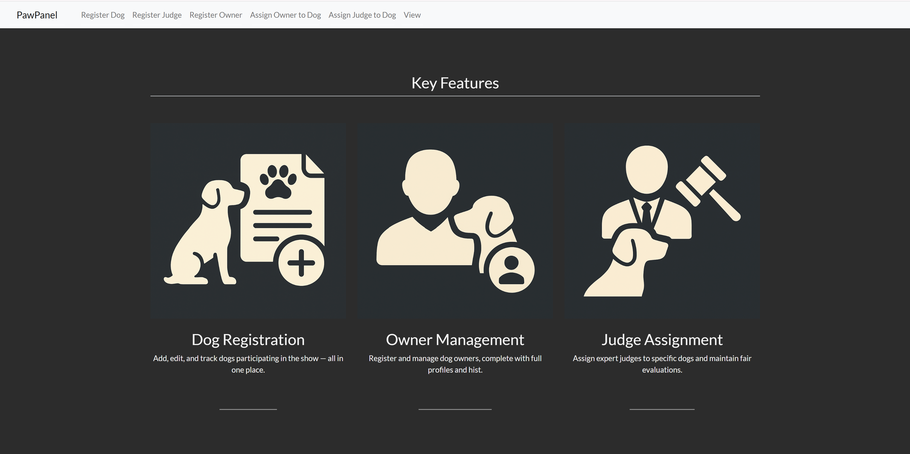
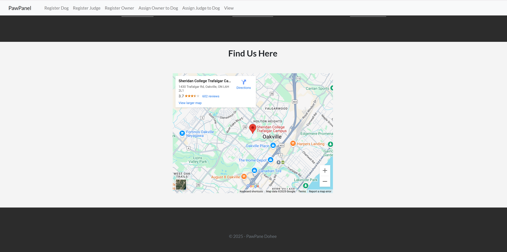

# PawPanel

Welcome to the **PawPanel**! This project is designed to help manage dog shows efficiently by providing features for registering dogs, assigning judges, managing owners, and more.

## Features

- **Dog Registration**: Add, edit, and track dogs participating in the show.
- **Owner Management**: Register and manage dog owners.
- **Judge Assignment**: Assign expert judges to specific dogs for fair evaluations.
- **Event Viewing**: View all registered participants and assignments in one place.

## Screenshots

### Home Page








---


---


## How to Run

1. Clone the repository:
   ```bash
   git clone <repository-url>
   ```
2. Navigate to the project directory:
   ```bash
   cd PawPanel
   ```
3. Run the application using Maven:
   ```bash
   ./mvnw spring-boot:run
   ```
4. Open your browser and go to `http://localhost:8080`.

## Technologies Used

- **Java**: Backend logic
- **Spring Boot**: Framework for building the application
- **Thymeleaf**: Template engine for dynamic HTML rendering
- **Bootstrap**: Frontend styling

## Folder Structure

- `src/main/java`: Contains the Java source code, including controllers, repositories, and beans.
- `src/main/resources/templates`: Thymeleaf templates for the frontend.
- `src/main/resources/static`: Static resources like CSS and images.

## License

This project is licensed under the MIT License. Feel free to use and modify it as needed.
